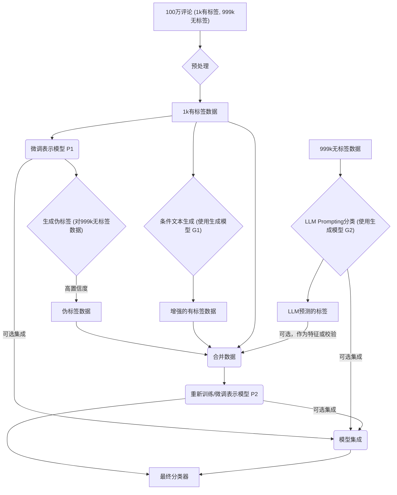

# 第4章 文本分类
## Q40：如何基于表示模型生成的嵌入向量实现文本分类？

A40：
基于表示模型（如 Word2Vec, GloVe, BERT, Sentence-BERT 等）生成的嵌入向量实现文本分类，主要步骤如下：

1.  **文本预处理**：
    *   对输入的文本进行清洗，如去除特殊字符、HTML标签、转换为小写等。
    *   进行分词（Tokenization），将文本切分成词元（tokens）。对于某些模型（如BERT），可能还需要添加特殊的标记（如 `[CLS]`，`[SEP]`）。

2.  **生成嵌入向量**：
    *   **词嵌入 (Word Embeddings)**: 如果使用的是词嵌入模型，每个词元会被映射到一个固定维度的向量。对于整个文本，可以通过以下方式获得句子/文档级别的嵌入：
        *   **平均池化 (Average Pooling)**: 计算文本中所有词元向量的平均值。
        *   **最大池化 (Max Pooling)**: 取所有词元向量在每个维度上的最大值。
        *   **[CLS] 标记的输出**: 对于像 BERT 这样的模型，通常会使用其特殊标记 `[CLS]` 对应位置的输出隐状态作为整个序列的表示。
    *   **句子/文档嵌入 (Sentence/Document Embeddings)**: 如果使用的是专门为生成句子或文档级别嵌入而设计的模型（如 Sentence-BERT, Universal Sentence Encoder），可以直接将预处理后的文本输入模型，得到整个文本的固定维度嵌入向量。

3.  **构建分类器**：
    *   将上一步得到的文本嵌入向量作为特征输入到一个分类模型中。
    *   常用的分类器包括：
        *   **逻辑回归 (Logistic Regression)**
        *   **支持向量机 (Support Vector Machines, SVM)**
        *   **朴素贝叶斯 (Naive Bayes)** (虽然通常用于词袋模型，但也可用于嵌入特征)
        *   **K近邻 (K-Nearest Neighbors, KNN)**
        *   **决策树 (Decision Trees) / 随机森林 (Random Forests) /梯度提升树 (Gradient Boosting Trees)**
        *   **浅层神经网络 (Shallow Neural Networks)**，如一个或多个全连接层后接 Softmax/Sigmoid 激活函数。
        *   **深度神经网络 (Deep Neural Networks)**: 如果有足够的数据，也可以构建更复杂的神经网络结构。

4.  **模型训练**：
    *   使用带有标签的训练数据集。每个样本包含一个文本及其对应的类别标签。
    *   将训练集中的每个文本转换为嵌入向量。
    *   用这些嵌入向量和对应的标签来训练所选择的分类器。训练的目标是学习从嵌入向量到类别标签的映射关系，最小化预测错误。

5.  **模型评估**：
    *   使用一个独立的测试数据集（未在训练中使用的带标签数据）来评估分类器的性能。
    *   常用的评估指标包括准确率 (Accuracy)、精确率 (Precision)、召回率 (Recall)、F1分数 (F1-score)、混淆矩阵 (Confusion Matrix)、AUC-ROC 等。

6.  **模型预测/推理**：
    *   对于新的、未见过的文本：
        *   进行同样的文本预处理。
        *   使用训练好的表示模型生成其嵌入向量。
        *   将嵌入向量输入到训练好的分类器中，得到预测的类别标签。

**总结：**
核心思想是将非结构化的文本数据通过表示模型转换为结构化的、固定长度的数值向量（嵌入），这些向量能够捕捉文本的语义信息。然后，利用这些语义丰富的向量作为特征，训练传统的机器学习分类器或简单的神经网络来进行分类任务。这种方法将复杂的自然语言理解问题分解为特征提取（嵌入生成）和分类两个相对独立的阶段。如果表示模型是预训练的，并且在大型语料库上学习到了通用的语言表示，那么即使只有少量的标注数据用于训练分类器，也可能获得不错的效果。
## Q41：使用嵌入向量实现分类和使用生成模型直接分类的方法相比，有什么优缺点？

A41：
将文本分类任务的两种主要方法进行比较：一种是基于表示模型（生成嵌入向量）后接一个分类器，另一种是使用生成式大语言模型（LLM）直接进行分类。它们各有优缺点：

**方法一：嵌入向量 + 分类器 (如 BERT + 逻辑回归/SVM)**

*   **优点**：
    1.  **高效性 (Efficiency)**：
        *   **训练效率**：如果使用预训练的嵌入模型（如 Sentence-BERT），通常只需要训练一个相对较小的分类器（如逻辑回归或浅层神经网络）。这比端到端微调整个大型生成模型要快得多，计算资源需求也更低。
        *   **推理速度**：一旦文本被转换为嵌入向量，后续分类器的推理通常非常快。嵌入生成本身也可以被优化。
    2.  **可解释性 (Interpretability)**：传统的分类器（如逻辑回归、决策树）具有一定的可解释性，可以分析特征（嵌入向量的维度，尽管这些维度本身可能不直接可解释）对分类结果的贡献。
    3.  **成熟度与稳定性 (Maturity & Stability)**：这种方法论比较成熟，有大量的研究和实践经验，模型行为相对稳定和可预测。
    4.  **数据需求**：对于分类器部分的训练，虽然仍需要标注数据，但有时对数据量的需求可能比微调大型生成模型要少，特别是当预训练嵌入本身质量很高时。
    5.  **易于集成 (Ease of Integration)**：嵌入向量可以作为标准特征输入到各种现有的机器学习流水线和系统中。

*   **缺点**：
    1.  **两阶段优化 (Two-stage Optimization)**：嵌入模型的优化目标（例如，在预训练阶段学习通用语言表示）与最终分类任务的优化目标可能不完全一致。这可能导致次优的性能。
    2.  **信息损失 (Information Loss)**：将文本压缩成固定长度的嵌入向量可能会丢失一些对特定分类任务有用的细微信息。
    3.  **对嵌入质量的依赖 (Dependency on Embedding Quality)**：分类性能高度依赖于嵌入向量的质量。如果嵌入不能很好地区分不同类别的文本，后续分类器也难以取得好效果。
    4.  **领域适应性 (Domain Adaptation)**：通用的预训练嵌入可能在特定领域或任务上表现不佳，需要额外的领域适应微调（Fine-tuning the embedding model）才能获得最佳效果，这会增加复杂性。
    5.  **无法处理开放式或动态类别 (Cannot Handle Open/Dynamic Classes Easily)**：如果类别集合发生变化，通常需要重新训练分类器。

**方法二：生成模型直接分类 (如 GPT-3/4, Llama 进行零样本或少样本分类)**

*   **优点**：
    1.  **强大的泛化能力 (Strong Generalization)**：大型生成模型在海量数据上进行了预训练，学习了丰富的世界知识和语言模式，具有很强的泛化能力，通常在零样本（Zero-shot）或少样本（Few-shot）场景下就能取得不错的效果。
    2.  **灵活性与适应性 (Flexibility & Adaptability)**：
        *   **零样本/少样本学习**：无需或只需少量标注样本即可通过精心设计的提示（Prompt Engineering）进行分类。
        *   **处理动态类别**：可以通过修改提示来适应新的类别，而无需重新训练整个模型。
        *   **复杂指令遵循**：可以理解更复杂的分类指令和上下文。
    3.  **端到端学习 (End-to-End Learning)**：如果进行微调，模型可以直接针对最终的分类任务进行优化，理论上可以达到更好的性能上限。
    4.  **生成解释 (Generating Explanations)**：除了分类标签，生成模型还可以被提示生成分类的理由或解释，增强可信度和可理解性。

*   **缺点**：
    1.  **计算成本高 (High Computational Cost)**：
        *   **推理成本**：大型生成模型的推理通常比小型分类器慢得多，需要更多的计算资源（如高端 GPU）。
        *   **微调成本**：微调整个大型生成模型需要大量的计算资源和时间。
    2.  **提示工程的挑战 (Prompt Engineering Challenges)**：分类性能高度依赖于提示的设计。找到最优提示可能需要大量的实验和技巧，有时结果不稳定或难以复现。
    3.  **输出格式控制 (Output Format Control)**：确保模型严格按照要求的格式输出类别标签（例如，只输出 'positive' 或 'negative'）可能比较困难，有时会产生无关的文本，需要后处理。
    4.  **“黑箱”特性 (Black-box Nature)**：大型生成模型的决策过程通常难以解释，理解为什么模型做出某个分类决策比较困难。
    5.  **潜在的偏见和幻觉 (Potential Biases & Hallucinations)**：预训练数据中可能存在的偏见会被模型学到并影响分类结果。模型也可能产生“幻觉”，即生成不符合事实的分类理由。
    6.  **API 依赖与成本 (API Dependency & Cost)**：如果使用闭源的商业模型 API（如 OpenAI API），会产生持续的费用，并且依赖于服务提供商的可用性和政策。

**总结与选择建议**：

*   **选择嵌入向量 + 分类器**：
    *   当计算资源有限，追求高效率和低延迟时。
    *   当有足够的高质量标注数据来训练一个鲁棒的分类器时。
    *   当任务相对简单，类别固定，且对可解释性有一定要求时。
    *   当需要将文本分类集成到现有的、基于特征的机器学习系统中时。

*   **选择生成模型直接分类**：
    *   当标注数据稀缺（零样本或少样本场景）时。
    *   当需要快速原型验证或处理动态变化的类别时。
    *   当任务复杂，需要模型理解更深层次的语义或上下文时。
    *   当可以接受较高的计算成本和延迟，且追求极致性能（尤其是在微调后）或需要生成解释时。
    *   当需要处理开放式问题，或者分类标准比较主观和 nuanced 时。

在实践中，也可以结合两者，例如使用生成模型进行数据增强或生成伪标签，来帮助训练基于嵌入的分类器。
## Q42：如果没有标注数据，如何基于嵌入模型实现文本分类？如何优化标签描述来提高零样本分类的准确率？

A42：
在没有标注数据的情况下，基于嵌入模型实现文本分类通常依赖于**零样本学习 (Zero-Shot Learning, ZSL)** 的思想，特别是利用嵌入向量的语义相似性。以下是主要方法和优化策略：

**基于嵌入模型实现零样本文本分类的方法：**

1.  **基于与类别描述的相似度**：
    *   **步骤**：
        1.  **定义类别标签描述 (Label Descriptions)**：为每个目标类别创建一个或多个描述性的文本短语或句子。例如，对于情感分类，类别 “positive” 的描述可以是 “a positive sentiment review” 或 “This text expresses happiness and satisfaction”。
        2.  **获取类别嵌入 (Label Embeddings)**：使用与处理输入文本相同的嵌入模型（如 Sentence-BERT）将这些类别描述转换为嵌入向量。
        3.  **获取文本嵌入 (Text Embedding)**：对于需要分类的输入文本，同样使用该嵌入模型生成其嵌入向量。
        4.  **计算相似度 (Calculate Similarity)**：计算输入文本嵌入与每个类别嵌入之间的相似度。常用的相似度度量包括余弦相似度 (Cosine Similarity)。
        5.  **分配类别 (Assign Class)**：将输入文本分配给与其嵌入向量最相似的类别描述所对应的类别。
    *   **原理**：这种方法假设，如果一个文本在语义上接近某个类别的描述，那么它们的嵌入向量在向量空间中也应该彼此靠近。

2.  **利用自然语言推理 (Natural Language Inference, NLI) 模型进行零样本分类**：
    *   **步骤**：
        1.  **构建前提-假设对 (Premise-Hypothesis Pairs)**：将待分类的文本作为“前提 (premise)”。为每个可能的类别构造一个“假设 (hypothesis)”语句，通常形式为 “This text is about [category name].” 或 “The topic of this text is [category name].”
        2.  **获取 NLI 模型预测**：将每个前提-假设对输入到一个预训练的 NLI 模型（如基于 BERT 或 RoBERTa 的 NLI 模型，这些模型被训练来判断前提和假设之间的关系：蕴含 entailment, 矛盾 contradiction, 中立 neutral）。
        3.  **分配类别**：选择那个使得 NLI 模型预测为“蕴含 (entailment)”概率最高的假设所对应的类别作为文本的类别。
    *   **原理**：NLI 模型学习了判断两个句子之间逻辑关系的能力。如果一个文本蕴含了“这个文本是关于体育的”这个假设，那么该文本很可能属于“体育”类别。
    *   **与嵌入模型的联系**：NLI 模型内部也依赖于强大的文本表示（嵌入）来做出判断。

**如何优化标签描述来提高零样本分类的准确率？**

优化标签描述对于基于相似度的零样本分类至关重要，因为描述的质量直接影响类别嵌入的代表性和区分度。以下是一些优化策略：

1.  **使用多个描述并平均嵌入 (Multiple Descriptions & Averaging)**：
    *   为一个类别提供多个不同的、但语义一致的描述。例如，对于“科技”类别，可以使用 “technology news”, “articles about gadgets and software”, “scientific innovations”。
    *   分别计算这些描述的嵌入，然后将它们平均（或使用其他聚合方法）得到一个更鲁棒的类别嵌入。这有助于平滑单个描述可能带来的偏差。

2.  **使用更具体和区分性的描述 (Specific and Discriminative Descriptions)**：
    *   避免使用过于宽泛或模糊的词语。描述应该清晰地指向类别的核心概念，并尽量与其他类别的描述区分开。
    *   例如，如果分类新闻主题，用 “articles about political elections and government policies” 比简单用 “politics” 可能更好，因为它更具体。

3.  **保持描述的结构和风格一致性 (Consistent Structure and Style)**：
    *   尽量使不同类别的描述在结构和风格上保持一致。例如，都使用 “This text is about [topic]” 的模板。
    *   这有助于模型更好地关注内容差异而非表述差异。

4.  **利用上位词/下位词和相关概念 (Hypernyms/Hyponyms & Related Concepts)**：
    *   在描述中可以包含类别的上位词（更通用的概念）或下位词（更具体的例子），以及强相关的概念，以丰富类别的语义表示。
    *   例如，对于“动物”类别，可以加入 “mammals, birds, reptiles, and fish”。

5.  **迭代和实验 (Iteration and Experimentation)**：
    *   尝试不同的描述组合，并在一个小的验证集（如果可能，即使是无标签的，也可以通过人工检查少量样本的分类结果来辅助判断）上评估效果。
    *   分析错误分类的样本，看看是否可以通过修改类别描述来纠正。

6.  **利用外部知识库 (Leverage External Knowledge Bases)**：
    *   从 Wikipedia、WordNet 等知识库中获取类别的定义、同义词、相关概念等来构建或丰富描述。

7.  **考虑嵌入模型的特性 (Consider Embedding Model Characteristics)**：
    *   了解你所使用的嵌入模型是如何训练的，它对什么样的文本更敏感。例如，某些模型可能对句子结构更敏感，而另一些则更关注关键词。
    *   如果嵌入模型对句子长度敏感，尽量使不同类别的描述长度大致相当。

8.  **上下文增强 (Contextual Enrichment for Descriptions)**：
    *   有时，简单地将类别名称作为描述可能不够。可以尝试将类别名称放入一个更完整的句子中，提供更多上下文。例如，不仅仅是 “Sports”，而是 “This piece of text discusses topics related to sports.”

通过精心设计和优化类别描述，可以显著提升基于嵌入的零样本文本分类的准确性，使其在没有标注数据的情况下也能达到可用的水平。
## Q43：书中嵌入模型 + 逻辑回归的分类方式获得了 0.85 的 F1 分数，而零样本分类方式获得了 0.78 的 F1 分数，如果有标注数据，什么情况下会选择零样本分类？

A43：
尽管在有标注数据的情况下，传统的监督学习方法（如嵌入模型 + 逻辑回归）通常能获得比零样本分类更高的性能（例如书中提到的 F1 分数 0.85 vs 0.78），但在某些特定场景下，即使有标注数据，也可能会选择或倾向于使用零样本分类。这些情况主要包括：

1.  **标注数据量非常少 (Very Limited Labeled Data)**：
    *   虽然“有”标注数据，但如果数量极其稀少（例如，每个类别只有几个或十几个样本），那么训练一个鲁棒的监督分类器（如逻辑回归）可能仍然很困难，容易过拟合，泛化能力差。
    *   在这种情况下，零样本分类依赖于预训练模型的强大先验知识，其表现可能相对更稳定，甚至可能优于用极少量数据训练的弱监督分类器。

2.  **快速原型验证和基线建立 (Rapid Prototyping and Baseline Establishment)**：
    *   在项目初期，需要快速验证一个想法或建立一个性能基线时，零样本分类几乎不需要额外的训练时间（除了可能需要调整提示或类别描述）。
    *   这可以快速了解任务的可行性，并为后续是否投入更多资源进行数据标注和模型训练提供决策依据。

3.  **类别动态变化或频繁更新 (Dynamic or Frequently Updated Classes)**：
    *   如果分类任务的类别集合不是固定的，而是经常需要添加新类别或修改现有类别，那么每次变化都重新训练监督分类器会非常耗时和昂贵。
    *   零样本分类（尤其是基于生成模型或 NLI 的方法）可以通过简单地修改类别描述或提示来适应新的类别，灵活性非常高。

4.  **探索性数据分析和类别发现 (Exploratory Data Analysis and Class Discovery)**：
    *   在对一个新数据集进行探索时，可能还不完全清楚数据中包含哪些有意义的类别。零样本分类可以用来测试不同的潜在类别划分，帮助理解数据结构。
    *   例如，可以尝试用不同的标签集对同一批数据进行零样本分类，观察哪些分类结果更有意义。

5.  **对新领域的初步适应 (Initial Adaptation to New Domains)**：
    *   当进入一个全新的领域，即使有一些标注数据，这些数据可能不足以覆盖领域的所有特性。零样本分类可以作为一种低成本的方式来初步处理该领域的数据，并可以与少量标注数据结合（例如，作为少样本学习的起点）。

6.  **成本和时间限制 (Cost and Time Constraints)**：
    *   数据标注和模型训练都需要成本和时间。如果项目预算紧张或交付周期非常短，零样本分类提供了一个“开箱即用”的解决方案，即使性能稍逊，也可能在特定业务需求下是可接受的。

7.  **需要可解释的分类依据（针对某些零样本方法）**：
    *   某些零样本方法（如基于生成模型并要求其解释分类原因）可以提供比传统分类器更自然的语言解释，这在某些需要高透明度的应用中可能比单纯的 F1 分数更重要。

8.  **作为更复杂系统的组件 (Component in a Larger System)**：
    *   零样本分类器可以作为更复杂系统（如混合系统、主动学习系统）的一部分。例如，可以用零样本分类器对大量未标注数据进行初步筛选或打上弱标签，然后将置信度高的结果或特别不确定的结果交给人工标注或用于训练更强的监督模型。

9.  **当性能差异不显著或可接受时 (When Performance Difference is Not Critical or Acceptable)**：
    *   如果 0.78 的 F1 分数对于特定应用场景已经足够好，或者与 0.85 的差异带来的业务价值提升不足以覆盖监督学习的额外成本，那么选择更简单、更快速的零样本方法也是合理的。

**需要注意的是**，如果拥有充足且高质量的标注数据，并且追求最佳的分类性能，那么针对特定任务微调嵌入模型并训练一个监督分类器，或者直接微调一个大型生成模型进行分类，通常仍然是首选策略。零样本分类在有标注数据时的选择更多是基于实用性、灵活性和成本效益的考量。
## Q44：Transformer 为什么比朴素贝叶斯分类器效果好很多？朴素贝叶斯分类器的条件独立性假设有什么问题？

A44：
Transformer 模型（尤其是基于 Transformer 的预训练模型如 BERT、GPT 等）在文本分类任务上通常远超传统的朴素贝叶斯 (Naive Bayes, NB) 分类器，主要原因在于它们能够更深刻地理解文本的语义、上下文和复杂语言现象，而朴素贝叶斯则受限于其过于简化的假设。

**为什么 Transformer 效果更好？**

1.  **上下文感知 (Contextual Understanding)**：
    *   **Transformer**：通过其核心的自注意力机制 (Self-Attention)，Transformer 能够动态地权衡句子中不同词语之间的重要性，并理解一个词在特定上下文中的含义。同一个词在不同语境下可以有不同的表示（嵌入）。
    *   **朴素贝叶斯**：通常基于词袋模型 (Bag-of-Words)，它只考虑词频，忽略词序和词语间的上下文关系。每个词被独立对待，无法捕捉“苹果公司”和“吃苹果”中“苹果”的不同含义。

2.  **强大的表示能力 (Powerful Representation Learning)**：
    *   **Transformer**：预训练的 Transformer 模型在海量文本数据上学习到了丰富的语言模式、语法结构和世界知识，能够生成高质量的文本嵌入向量，这些向量能有效捕捉文本的深层语义信息。
    *   **朴素贝叶斯**：特征表示简单（通常是词频或 TF-IDF），无法捕捉词语的语义相似性（例如，“高兴”和“开心”被视为完全不同的特征）。

3.  **处理长距离依赖 (Handling Long-Range Dependencies)**：
    *   **Transformer**：自注意力机制理论上可以直接关联序列中任意两个位置的词语，无论它们相距多远，从而有效捕捉长距离的语义依赖关系。
    *   **朴素贝叶斯**：完全无法处理词序和长距离依赖问题。

4.  **端到端学习与微调 (End-to-End Learning and Fine-tuning)**：
    *   **Transformer**：预训练模型可以通过在特定下游任务（如文本分类）的标注数据上进行微调，使其表示更适应任务需求，实现端到端的优化。
    *   **朴素贝叶斯**：模型结构固定，参数学习直接基于统计，没有类似微调的深度优化过程。

5.  **对数据量和复杂性的适应性 (Adaptability to Data Volume and Complexity)**：
    *   **Transformer**：模型容量大，能够从大规模数据中学习复杂模式。随着数据量的增加，其性能通常会持续提升。
    *   **朴素贝叶斯**：模型简单，参数较少，虽然在小数据集上可能表现尚可且不易过拟合，但在大数据集上很快会达到性能瓶颈，无法充分利用数据中的复杂信息。

**朴素贝叶斯分类器的条件独立性假设有什么问题？**

朴素贝叶斯分类器的核心是贝叶斯定理和**特征条件独立性假设 (Feature Conditional Independence Assumption)**。该假设指的是：**在给定类别 C 的情况下，文本中的各个特征（通常是词语）是相互独立的。**

即，如果一个文本 \(D\) 由词语 \(w_1, w_2, ..., w_n\) 组成，朴素贝叶斯假设：
\[ P(w_1, w_2, ..., w_n | C) = P(w_1|C) \times P(w_2|C) \times ... \times P(w_n|C) \]

这个假设存在以下严重问题：

1.  **与语言实际严重不符 (Strongly Violates Linguistic Reality)**：
    *   在自然语言中，词语的出现几乎总是有依赖关系的。例如，“New” 后面很可能跟着 “York”，“机器学习” 这两个词通常一起出现表示一个概念。
    *   词序、语法结构、搭配关系等都体现了词语间的依赖性。条件独立性假设完全忽略了这些语言现象。
    *   例如，对于短语 “not good”，朴素贝叶斯会独立看待 “not” 和 “good”。如果 “good” 在正面评价中常出现，即使有 “not”，模型也可能错误地倾向于正面分类，因为它无法理解 “not” 对 “good” 的否定作用。

2.  **丢失语义信息 (Loss of Semantic Information)**：
    *   由于忽略了词语组合和上下文，很多重要的语义信息会丢失。例如，“San Francisco” 和 “Francisco San” 在词袋模型和朴素贝叶斯看来是等价的（如果只看词频），但前者是一个地名，后者则不是。

3.  **对某些特征组合的敏感性 (Sensitivity to Certain Feature Combinations)**：
    *   虽然假设特征独立，但如果某些强相关的特征（实际上不独立）同时出现，它们对概率的贡献会被重复计算，可能导致对某些类别的概率估计产生偏差。

**尽管条件独立性假设在现实中几乎总是不成立的，但朴素贝叶斯分类器在实践中仍然常常表现出惊人的效果，尤其是在文本分类的早期阶段或某些特定场景下。这通常归因于：**

*   **结构简单，计算高效，易于实现。**
*   **对小数据集友好，不易过拟合。**
*   **即使概率估计不准确，只要最大后验概率对应的类别是正确的，分类结果就可能是正确的。** 它更多地依赖于哪个类别的“证据”更多，而不是精确的概率值。

然而，随着对文本理解深度要求的提高和可用数据量的增加，Transformer 等更复杂、更能捕捉语言细微差别的模型，其优势变得越来越明显。
## Q45：掩码语言建模与 BERT 的掩蔽策略相比有何不同？这种预训练方式如何帮助模型在下游的文本分类任务中获得更好的性能？

A45：
**掩码语言建模 (Masked Language Modeling, MLM)** 是一种通用的预训练任务，其核心思想是随机遮盖（mask）输入文本中的一部分词元 (tokens)，然后训练模型去预测这些被遮盖的词元。BERT (Bidirectional Encoder Representations from Transformers) 是一个著名的采用 MLM 进行预训练的模型，它有其特定的掩蔽策略。

**通用掩码语言建模 (MLM) vs. BERT 的具体掩蔽策略：**

*   **通用 MLM 概念**：
    *   从输入序列中随机选择一定比例（例如 15%）的词元进行处理。
    *   被选中的词元会被一个特殊的 `[MASK]` 标记替换。
    *   模型的目标是基于未被遮盖的上下文词元，预测出 `[MASK]` 位置原始的词元。
    *   这是一个自监督学习任务，因为它能从无标签文本中自动生成训练样本（输入是带 `[MASK]` 的句子，输出是原始句子中被遮盖的词）。

*   **BERT 的具体掩蔽策略**：
    BERT 在实现 MLM 时，为了缓解预训练和微调阶段之间的不匹配（因为微调阶段通常没有 `[MASK]` 标记），并鼓励模型学习更丰富的表示，采用了更精细的策略：
    1.  **选择要预测的词元**：随机选择输入序列中 15% 的词元作为预测目标。
    2.  **对选中的 15% 词元进行如下处理**：
        *   **80% 的概率**：将选中的词元替换为 `[MASK]` 标记。例如，“my dog is hairy” -> “my dog is `[MASK]`”。
        *   **10% 的概率**：将选中的词元替换为一个**随机的其他词元**。例如，“my dog is hairy” -> “my dog is apple”。这样做是为了让模型不仅学习预测 `[MASK]`，还要能判断当前词元是否被篡改，从而学习到词元间的相互关系和上下文表示。
        *   **10% 的概率**：保持选中的词元**不变**。例如，“my dog is hairy” -> “my dog is hairy”（但模型仍然需要预测这个位置的词是 “hairy”）。这样做是为了使模型的表示偏向于真实的观察词元，减轻预训练-微调的不匹配问题，因为模型不知道哪些词是它需要预测的，哪些是被随机替换的，哪些是原始的。

    所以，BERT 的掩蔽策略是通用 MLM 概念的一个具体实现，并加入了一些技巧来提升预训练效果和泛化能力。

**这种预训练方式如何帮助模型在下游的文本分类任务中获得更好的性能？**

MLM（尤其是 BERT 的实现方式）通过以下几个方面帮助模型在下游文本分类任务中取得优异性能：

1.  **学习深度双向上下文表示 (Deep Bidirectional Contextual Representations)**：
    *   MLM 迫使模型同时利用左侧和右侧的上下文信息来预测被遮盖的词元。这使得模型能够学习到每个词元在特定语境下的丰富语义表示，而不是像传统的单向语言模型那样只依赖于单侧上下文。
    *   对于文本分类，理解整个句子的完整上下文至关重要，双向性使得模型能更好地捕捉句子或文档的整体含义。

2.  **获取词汇和句法知识 (Acquisition of Lexical and Syntactic Knowledge)**：
    *   为了准确预测被遮盖的词，模型必须学习词汇层面的知识（例如，哪些词经常一起出现）和句法层面的知识（例如，句子结构、词性、依存关系等）。
    *   这些基础的语言理解能力对于区分不同类别的文本非常有帮助。

3.  **提升泛化能力 (Improved Generalization)**：
    *   在海量无标签文本上进行 MLM 预训练，使得模型接触到广泛的语言现象和领域知识。这使得模型学习到的表示具有很好的泛化性，能够适应各种不同的下游任务，包括文本分类，即使下游任务的标注数据有限。
    *   BERT 的 10% 随机替换和 10% 保持不变的策略，进一步增强了模型的鲁棒性和对真实词元分布的建模能力。

4.  **作为下游任务的良好初始化 (Good Initialization for Downstream Tasks)**：
    *   预训练好的 Transformer编码器（如 BERT 的编码器部分）可以作为下游文本分类模型的强大特征提取器。
    *   通常，在 BERT 的输出之上（例如，`[CLS]` 标记对应的输出向量）接一个简单的分类层（如全连接层 + Softmax），然后用下游任务的标注数据进行微调 (Fine-tuning)。
    *   由于模型已经具备了良好的语言理解基础，微调过程通常只需要相对较少的数据和较短的训练时间就能达到很好的效果。

5.  **捕捉细微语义差别 (Capturing Fine-grained Semantic Nuances)**：
    *   通过预测词元，模型被迫关注词语间的细微语义差别和用法。例如，它能学会区分近义词在不同上下文中的适用性。
    *   这种能力对于需要细致语义理解的文本分类任务（如情感分析中的复杂情感、主题分类中的子主题区分）尤为重要。

总结来说，MLM 预训练方式（特别是 BERT 的精巧设计）使得模型能够从大规模无标注文本中学习到深刻的、上下文感知的、可泛化的语言表示。这些表示蕴含了丰富的词汇、句法和语义知识，为下游的文本分类任务提供了一个非常强大的起点，从而显著提升了分类性能。
## Q46：假设你有一个包含 100 万条客户评论的数据集，但只有 1000 条带有标签的数据，同时利用有标签和无标签数据，结合表示模型和生成模型的优势，构建一个分类系统？

A46：
这是一个典型的半监督学习 (Semi-Supervised Learning, SSL) 场景，目标是利用大量未标记数据和少量已标记数据来提高模型性能。结合表示模型（如 BERT, RoBERTa）和生成模型（如 GPT 系列）的优势可以构建一个强大的分类系统。以下是一个可能的方案：

**核心思路：**

1.  **利用表示模型进行特征提取和初步分类器训练**：表示模型擅长从文本中学习高质量的上下文感知嵌入。
2.  **利用生成模型进行数据增强和伪标签生成**：生成模型可以生成新的训练样本或为未标记数据生成高质量的伪标签。
3.  **结合两者进行迭代训练或集成**：通过迭代过程或模型集成来充分利用两者的优势。

**具体步骤：**

**阶段一：利用表示模型和少量有标签数据**

1.  **预处理**：对所有数据（有标签和无标签）进行文本清洗、分词等预处理操作。
2.  **训练初始表示模型**：
    *   选择一个预训练的表示模型（例如，BERT-base 或针对评论领域微调过的版本）。
    *   使用 1000 条有标签数据对该表示模型进行微调，以适应客户评论分类任务。在 BERT 的 `[CLS]` 输出后接一个分类头。
    *   这是一个初步的分类器，性能可能受限于少量标签数据。

**阶段二：利用无标签数据和生成模型进行增强**

这一阶段有多种策略可以采用，可以根据实际效果选择或组合：

*   **策略 A：基于表示模型的伪标签 (Pseudo-Labeling / Self-Training)**
    1.  **生成伪标签**：使用阶段一训练好的初步分类器对 100 万条无标签数据进行预测。选择置信度较高的预测结果作为“伪标签”。
    2.  **扩充训练集**：将带有伪标签的数据与原始的 1000 条有标签数据合并。
    3.  **重新训练表示模型**：使用扩充后的数据集重新训练或进一步微调表示模型。可以迭代这个过程，逐步提高伪标签的质量和模型的性能。

*   **策略 B：利用生成模型进行数据增强 (Data Augmentation)**
    1.  **条件文本生成**：
        *   **基于标签的生成**：使用 1000 条有标签数据，训练一个条件生成模型（例如，微调一个小型 GPT 模型，或者使用 few-shot prompting 的大型 GPT 模型），使其能够根据给定的类别标签生成新的、与该类别相关的客户评论。例如，输入 “生成一条关于产品质量差的负面评论”，模型输出相应的评论文本。
        *   **基于已有样本的改写/扩充**：利用生成模型对已有的有标签评论进行同义词替换、句子结构变换、扩充细节等，生成多样化的新样本，同时保持原始标签。
    2.  **扩充训练集**：将生成的新样本（带有原始或生成时指定的标签）加入到 1000 条有标签数据中。
    3.  **训练表示模型**：使用扩充后的数据集训练或微调表示模型。

*   **策略 C：利用生成模型进行零样本/少样本分类辅助伪标签**
    1.  **设计有效的 Prompt**：对于生成模型（特别是大型语言模型，LLM），精心设计针对客户评论分类任务的 Prompt。例如：
        ```
        以下是一条客户评论：
        "[评论文本]"
        请判断这条评论的情感类别（例如：正面、负面、中性）。
        类别：
        ```
    2.  **生成模型预测**：让生成模型对一部分或全部无标签数据进行分类预测。
    3.  **与表示模型结果融合或校验**：
        *   可以将生成模型的预测结果作为一种“软标签”或额外的特征输入到表示模型的训练中。
        *   对于表示模型生成的伪标签，可以使用生成模型的预测结果进行交叉验证，只保留两者一致或高置信度的伪标签。

**阶段三：模型集成与最终分类系统**

1.  **训练最终的表示模型分类器**：
    *   使用经过阶段二增强（伪标签、数据增强）的数据集，训练一个更强大的表示模型分类器。
    *   可以考虑更复杂的半监督学习算法，如 Co-training（如果可以构建两个视图）、UDA (Unsupervised Data Augmentation) 等，这些算法通常也依赖于表示模型。

2.  **可选：生成模型作为最终分类器或集成的一部分**：
    *   如果大型生成模型在零样本或少样本分类上表现足够好，并且推理成本可接受，可以直接将其作为分类器的一部分。
    *   **模型集成 (Ensemble)**：可以将基于表示模型的分类器和基于生成模型的分类器（通过 Prompting）的结果进行集成（例如，加权平均、投票）。这通常能带来更鲁棒和准确的性能。

**具体技术选型和考虑因素：**

*   **表示模型选择**：BERT, RoBERTa, DeBERTa 等都是优秀的选择。可以根据任务特点和计算资源选择合适的尺寸。
*   **生成模型选择**：
    *   **数据增强**：可以使用较小的可微调生成模型（如 T5, BART, GPT-2/GPT-Neo）或通过 API 调用大型生成模型（如 GPT-3.5/4）。
    *   **零/少样本分类**：大型生成模型通常表现更好。
*   **伪标签的质量控制**：设置合理的置信度阈值，避免引入过多噪声。可以采用逐步增加伪标签数据量的方式。
*   **数据增强的多样性和质量**：确保生成的数据既多样又与原始数据分布一致，避免引入偏见。
*   **计算资源**：训练和微调大型表示模型和生成模型都需要相当的计算资源。
*   **迭代优化**：整个过程可能需要多次迭代和调整超参数（如伪标签阈值、数据增强的量、不同模型的权重等）以达到最佳效果。

**总结流程图示例：**



通过这种结合方式，可以充分利用表示模型强大的特征学习能力和生成模型在数据生成、零/少样本学习方面的灵活性，从而在只有少量标注数据的情况下，有效利用大量未标注数据，构建出高性能的文本分类系统。
## Q47：使用生成模型进行文本分类时，以下三个提示词哪个会更有效？
– “Is the following sentence positive or negative?”
– “Classify the sentiment of this movie review as positive or negative.”
– “You are a sentiment analysis expert. Given a movie review, determine if it expresses a positive or negative opinion. Return only the label ‘positive’ or ‘negative’.”

A47：
在使用生成模型（特别是大型语言模型，LLM）进行文本分类时，提示词 (Prompt) 的设计对最终效果至关重要。其有效性取决于模型的训练方式、对指令的理解能力、任务的明确性以及提示词是否能引导模型产生期望格式的输出。

让我们分析这三个新的提示词选项：

**提示词 1: “Is the following sentence positive or negative?”**

*   **优点**：
    *   简洁明了，易于理解。
    *   直接提出了一个二元选择问题。
*   **缺点**：
    *   **开放式回答**：模型可能会回答 “Yes, it is positive.”，“It is negative.”，或者更复杂的句子，而不是简单地输出 “positive” 或 “negative”。这需要额外的后处理步骤来提取实际的类别标签。
    *   **可能不直接输出类别**：模型可能理解问题，但其生成偏好可能不是直接给出类别词。
    *   **上下文不够具体**：“the following sentence” 比较通用，如果能指明文本类型（如“电影评论”）可能会更好。

**提示词 2: “Classify the sentiment of this movie review as positive or negative.”**

*   **优点**：
    *   **明确指示任务**：使用了 “Classify” (分类) 和 “sentiment” (情感) 这样的关键词。
    *   **明确了类别选项**：直接给出了 “positive or negative” 作为分类的目标标签。
    *   **上下文更具体**：指明了文本是 “this movie review”，比提示词1更聚焦。
*   **缺点**：
    *   **仍然可能产生描述性回答**：虽然比提示词 1 更明确，但模型仍可能回答 “The sentiment of this movie review is positive.” 而不是直接输出 “positive”。后处理可能仍然需要。

**提示词 3: “You are a sentiment analysis expert. Given a movie review, determine if it expresses a positive or negative opinion. Return only the label ‘positive’ or ‘negative’.”**

*   **优点**：
    *   **角色扮演 (Role Playing)**：“You are a sentiment analysis expert.” 这种方式可以引导模型进入特定角色，可能激活其在相关领域知识上的能力，从而提高准确性。
    *   **任务描述清晰**：“Given a movie review, determine if it expresses a positive or negative opinion.” 清晰地描述了任务和输入。
    *   **输出格式明确**：“Return only the label ‘positive’ or ‘negative’.” 这是最关键的优点，它非常明确地指示了模型应该输出的格式，大大减少了模型自由发挥的空间，使得输出更容易被程序解析。
    *   **上下文具体**：明确了输入是“movie review”。
*   **缺点**：
    *   **略显冗长**：相比前两个提示词，这个提示词更长。但对于现代LLM来说，这点长度通常不是问题，明确性带来的好处往往更大。
    *   **依赖模型对指令的遵循能力**：虽然指令很明确，但模型的遵循程度仍然是关键。不过，现代LLM通常对这类明确指令的遵循能力较强。

**哪个更有效？**

**通常情况下，提示词 3 (“You are a sentiment analysis expert. Given a movie review, determine if it expresses a positive or negative opinion. Return only the label ‘positive’ or ‘negative’.”) 会更有效，原因如下：**

1.  **高度的指令明确性**：它不仅定义了任务、输入类型、情感类别，最重要的是**严格规定了输出的格式** (“Return only the label ‘positive’ or ‘negative’”)。这最大程度地减少了模型输出的模糊性，使得结果可以直接使用，无需或只需极少的后处理。
2.  **角色扮演引导**：赋予模型一个“情感分析专家”的角色，有助于模型调用其相关的知识和推理能力，可能产生更专业的判断。
3.  **上下文具体化**：明确指出处理的是“电影评论”，有助于模型聚焦于特定领域的语言模式和情感表达方式。

**为什么提示词 3 通常优于其他两者：**

*   **提示词 1** 最为模糊，输出格式不确定，上下文也不够具体。
*   **提示词 2** 在任务和上下文上有所改进，但仍然没有对输出格式做严格限定，模型仍可能生成描述性语句。
*   **提示词 3** 通过结合角色扮演和极其明确的输出格式指令，最能引导模型产生期望的、可直接用于后续处理的标签。

**结论：**

虽然最佳提示词的效果可能仍需通过实验在特定模型上验证，但**提示词 3** 因其高度的明确性、角色引导以及对输出格式的严格控制，理论上是最有潜力获得最佳和最一致结果的。它体现了现代提示工程中强调清晰指令和格式控制的核心原则。在实践中，如果模型对长指令的理解能力足够好，这种详细且明确的提示词往往能带来更好的性能和更可靠的输出。