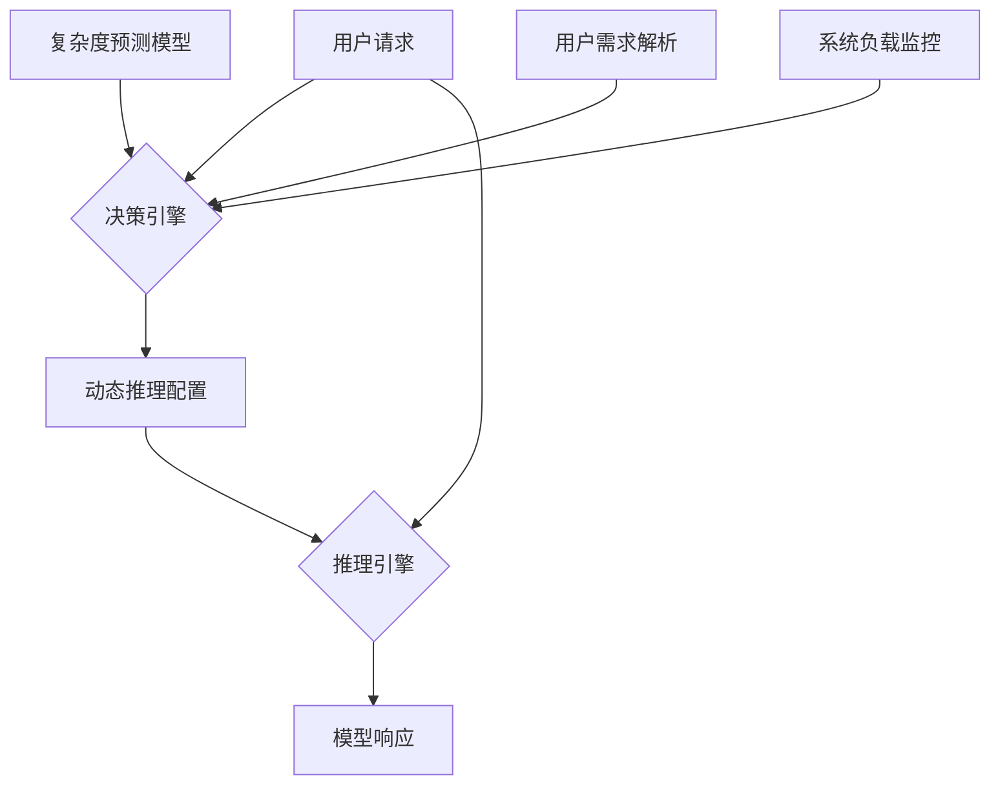

# 第13章 图解推理大模型
## Q166：根据缩放定律，如何估算训练一个特定规模的大模型所需的预训练数据集大小和所需算力？

**答案：**

估算大模型训练所需的数据集大小和算力，主要依据的是业界广泛认可的**Chinchilla缩放定律 (Chinchilla Scaling Laws)**。该定律由DeepMind在2022年提出，其核心观点是：**在固定的算力预算下，模型性能的最优解并非无限制地增大模型规模，而是应该协同增加模型参数量和训练数据量。**

### 1. 估算预训练数据集大小

Chinchilla定律给出了一个至关重要的结论：**为了达到最优性能，模型的参数量 (N) 和训练数据集的Token数量 (D) 应该大致成线性关系。**

- **核心比例**：研究发现，模型参数量和数据量的最优比例约为 **1 : 20**。也就是说，模型中的每1个参数，都应该用大约20个Token来进行训练。

- **估算公式**：
  $
  \text{最佳数据集大小 (Tokens)} \approx \text{模型参数量} \times 20
  $

- **示例**：
  *   如果要训练一个 **Llama-3 8B** (80亿参数) 的模型，所需的数据集大小约为：
      $
      8 \times 10^9 \text{ 参数} \times 20 \text{ Tokens/参数} = 160 \times 10^9 \text{ Tokens} = 1600\text{亿 Tokens}
      $
  *   如果要训练一个 **Llama-3 70B** (700亿参数) 的模型，所需的数据集大小约为：
      $
      70 \times 10^9 \text{ 参数} \times 20 \text{ Tokens/参数} = 1400 \times 10^9 \text{ Tokens} = 1.4\text{万亿 Tokens}
      $
    *注：Meta在训练Llama-2时使用了2万亿Token，而Llama-3则使用了高达15万亿的Token，这表明业界倾向于使用比Chinchilla定律建议的更多数据来追求极致性能。*

### 2. 估算所需算力

训练一个大模型所需的总计算量（以FLOPs为单位）可以通过一个简化的经验公式来估算。

- **核心公式**：
  $
  \text{总算力 (FLOPs)} \approx 6 \times \text{模型参数量 (N)} \times \text{训练数据量 (D)}
  $

- **公式解析**：
  *   **模型参数量 (N)**：模型的总参数数量。
  *   **训练数据量 (D)**：用于训练的总Token数量。
  *   **系数 6**：这个数字是一个经验常数，它代表了处理每个Token所需的计算量。其来源如下：
      *   **前向传播**：对于一个Transformer模型，处理一个Token的计算量大约是 `2 * N` FLOPs。
      *   **反向传播**：根据链式法则，反向传播的计算量大约是前向传播的2倍，即 `4 * N` FLOPs。
      *   **总和**：因此，模型训练中处理一个Token（一次完整的前向和反向传播）的总计算量约为 `2N + 4N = 6N` FLOPs。

- **示例**：
  *   我们继续以训练一个 **70B** 模型为例，并使用上一步估算的 **1.4万亿** Token数据量：
      $
      \begin{aligned}
      \text{总算力} & \approx 6 \times (70 \times 10^9) \times (1.4 \times 10^{12}) \\
      & = 588 \times 10^{21} \\
      & = 5.88 \times 10^{23} \text{ FLOPs}
      \end{aligned}
      $

**总结**

| 模型规模 | 最佳数据集大小 (估算) | 所需总算力 (估算) |
| :--- | :--- | :--- |
| **8B** | 1600亿 Tokens | \(6 \times 8 \times 10^9 \times 160 \times 10^9 \approx 7.68 \times 10^{22}\) FLOPs |
| **70B** | 1.4万亿 Tokens | \(6 \times 70 \times 10^9 \times 1.4 \times 10^{12} \approx 5.88 \times 10^{23}\) FLOPs |
| **175B** | 3.5万亿 Tokens | \(6 \times 175 \times 10^9 \times 3.5 \times 10^{12} \approx 3.675 \times 10^{24}\) FLOPs |

需要强调的是，以上均为理论估算。在实际工程中，总算力还会受到硬件效率（如A100/H100的MFU）、混合精度训练、重计算（Re-computation）等多种因素的影响。
## Q167：从大模型原理的角度说明，为什么 Llama-3 70B 模型不可能在不输出思维链的前提下，可靠地解决 24 点问题。（即输入 24 点的问题描述和 4 个 100 以内的整数，要求立即输出一个单词 Yes 或 No）

**答案：**

从大模型的原理上讲，即使是Llama-3 70B这样强大的模型，也无法在不输出思维链（Chain of Thought, CoT）的前提下可靠地解决24点问题。其根本原因在于**标准自回归模型固有的“计算深度限制”与24点问题所需的“可变深度推理”之间的深刻矛盾**。

我们可以将模型的思考方式类比为人类的“系统1”和“系统2”思维：

*   **系统1（直觉思考）**：快速、并行、无意识的模式匹配。这是标准大模型的核心工作模式。
*   **系统2（逻辑思考）**：缓慢、串行、有意识的逻辑推理和计算。这是解决24点问题所必需的模式。

### 1. 自回归模型的“固定计算深度” (系统1模式)

一个标准的Transformer大模型，无论其参数量多大，其基本工作方式是**自回归生成**。当它要生成下一个词元（Token）时，它会执行一次完整的前向传播（Forward Pass）。这次传播所经过的计算步骤是**固定**的，等于其网络的层数（例如，Llama-3 70B有80层）。

*   **计算量恒定**：对于任何输入，模型为了决定输出是“Yes”还是“No”，所执行的计算量（FLOPs）是基本恒定的。它不能根据问题的难度动态增加“思考”的步数。
*   **模式匹配而非真实计算**：模型的700亿参数中存储的是海量文本数据中学习到的统计规律和模式。当看到`{3, 3, 8, 8}`这几个数字时，它可能会因为在训练数据中见过类似的组合能得到24（例如 `8 / (3 - 8/3)`），从而倾向于输出“Yes”。但这个过程是**模式匹配**，不是**执行计算**。模型本身没有一个内置的、可以动态执行加减乘除的算术逻辑单元（ALU）。

### 2. 24点问题的“可变计算深度” (系统2需求)

解决24点问题是一个典型的**搜索和推理**任务，其计算过程具有以下特点：

*   **多步性**：需要进行一系列运算，例如 `(8 - 3) * 5 - 1`。
*   **状态依赖**：每一步的计算都依赖于上一步的结果。
*   **可变深度**：不同的数字组合可能需要不同数量的步骤来验证，这是一个计算深度不确定的问题。

### 矛盾点：用固定的“思考步数”解决需要可变步数的问题

要求模型直接输出“Yes”或“No”，本质上是强迫它在**一次前向传播**（固定的80层计算）内，完成一个可能需要任意多步才能解决的搜索问题。这在计算上是不可能的。模型无法在内部默默地、动态地进行排列组合和试错。它的“直觉”（系统1）可以处理它见过的、简单的模式，但对于一个需要严谨、多步验证的逻辑问题，这种直觉是不可靠的。

### 思维链（CoT）如何解决这个问题？

当模型被引导输出思维链时，例如 `“Let's think step by step. First, I can try 8 / (3 - 8/3) = 24. So the answer is Yes.”`，情况发生了根本性的改变。

*   **将深度问题转化为长度问题**：模型不再需要一次性完成所有计算。它将复杂的推理任务**分解**成一系列简单的、线性的生成任务。
*   **“外部化”的工作记忆**：每生成一个中间步骤（如`8 / 3`），这个结果就作为文本被写入了上下文（Context），成为下一步生成的依据。这相当于为模型提供了一个**外部的“草稿纸”或“工作记忆”**，极大地弥补了其内部计算深度的不足。
*   **串行化的系统2模拟**：通过一步步生成文本，模型用其强大的系统1能力（生成下一个最可能的词元）来**模拟**了一个缓慢、串行的系统2推理过程。

**总结**

| 模型模式 | 计算方式 | 对应思维 | 是否能解24点 | 原因 |
| :--- | :--- | :--- | :--- | :--- |
| **直接输出** | 一次前向传播，固定计算深度 | **系统1 (直觉)** | **不可靠** | 固定的计算步数无法完成可变深度的搜索和推理任务。 |
| **思维链 (CoT)** | 多次前向传播，生成中间步骤 | **模拟系统2 (逻辑)** | **可靠** | 将深度问题转化为长度问题，利用外部文本作为工作记忆。 |
## Q168：通过“let’s think step by step”提示词触发的思维链模式，与推理模型的原理有什么不同？同样是测试时计算，为什么推理模型的上限更高？

**答案：**

这是一个非常深刻的问题，触及了当前大模型能力的边界。虽然思维链（Chain of Thought, CoT）和推理模型都在测试时（Inference Time）进行计算来解决问题，但它们的底层原理和能力上限有着天壤之别。

**核心区别在于：CoT是“模拟思考”，而推理模型是“执行思考”。**

*   **思维链 (CoT)**：是一种**提示工程技巧**，它诱导一个标准的自回归语言模型，通过生成文本来**模拟**一步步的推理过程。模型本身的核心机制没有改变，它仍然只是一个“文本续写”机器。
*   **推理模型 (Reasoning Model)**：是一种**特殊的模型架构或系统**，它内置了**搜索算法**（如蒙特卡洛树搜索 MCTS），能够主动地、系统地探索问题的可能性空间。

### 原理上的不同

| 特性 | 思维链 (Chain of Thought) | 推理模型 (Reasoning Model) |
| :--- | :--- | :--- |
| **核心机制** | **自回归生成 (Autoregressive Generation)** | **搜索算法 (e.g., MCTS) + 模型评估** |
| **思考方式** | **线性、单路径、不可回溯** | **树状、多路径、可回溯** |
| **探索能力** | **无 (纯粹的利用)**：它只会沿着概率最高的路径“一条道走到黑”。 | **有 (探索与利用的平衡)**：可以主动探索那些看起来不那么“直观”但可能通往正确答案的路径。 |
| **错误修正** | **无**：一旦在链条的早期犯错，错误会一直传播下去，无法纠正。 | **有**：通过搜索，可以发现某条路径是“死胡同”，然后**回溯 (Backtracking)** 到之前的节点，尝试其他选择。 |
| **计算分配** | 计算量与生成文本的长度成正比。 | 计算预算（如“思考时间”或模拟次数）可以在测试时**动态分配**，以集中算力攻克难题。 |

### 为什么推理模型的上限更高？

**1. 克服“贪心”的局限性 (Overcoming Greediness)**

CoT本质上是一个**贪心算法 (Greedy Algorithm)**。在每一步，模型都会选择概率最高的下一个词元。然而，许多复杂的推理问题（如数学、编程、策略游戏）的最优解，往往需要一些“反直觉”的、非贪心的步骤。CoT无法发现这些路径。

推理模型通过其探索机制（如MCTS中的UCT算法），能够暂时跳出“最明显”的选项，去探索那些长期来看更有潜力的分支，从而找到全局最优解。

**2. 系统性的搜索与评估**

CoT的推理过程是偶然的、启发式的，其质量高度依赖于模型在预训练阶段见过多少类似的推理模式。它不能保证找到答案。

推理模型则进行的是**系统性的搜索**。以AlphaGo为例，它会构建一个巨大的搜索树，评估成千上万种可能性，并基于一个明确的价值函数来指导决策。这种方法的鲁棒性和可靠性远超CoT。

**3. 测试时计算的有效扩展 (Effective Scaling of Test-Time Compute)**

这是最关键的区别。对于一个推理模型，我们可以通过**增加测试时的计算预算**（例如，将MCTS的模拟次数从1000次增加到10000次）来显著提升其在特定问题上的性能。更多的计算量意味着更深入、更广泛的搜索，从而得到更好的结果。

而对于CoT，简单地让它生成更长的文本并不能保证质量的提升，反而可能导致内容重复、逻辑混乱。它的性能在模型训练完成后就已经基本固定，测试时的计算增长带来的收益非常有限。

**总结与类比**

*   **思维链 (CoT)** 就像一个**业余徒步者**，只知道沿着一条最明显的、踩的人最多的路下山。如果这条路被堵死了，他就无能为力了。
*   **推理模型** 就像一个**专业登山家**，他带着地图、指南针和各种工具。他能看到多条下山的路径，可以评估每条路的风险和长度，甚至可以在一条路走不通时，退回到分叉口，选择另一条路。给他更多的时间（计算预算），他就能规划出更安全、更快捷的路线。

因此，虽然两者都在测试时“思考”，但推理模型通过其内在的搜索和评估机制，拥有了远超CoT的解决复杂问题的能力上限。
## Q169：推理模型的 RL 与非推理模型的 RLHF 有什么区别？

**答案：**

推理模型中使用的强化学习（RL）与我们熟知的用于对齐的RLHF（Reinforcement Learning from Human Feedback）虽然都利用了RL框架，但它们在**目标、奖励来源、训练范式和核心挑战**上存在根本性的区别。

简而言之：
*   **RLHF 的目标是“对齐” (Alignment)**：让模型学会人类的偏好，使其行为更符合人类价值观。
*   **推理RL 的目标是“能力” (Capability)**：让模型学会在有明确对错标准的任务中，如何通过推理找到正确答案。

下面是详细的对比：

| 特性 | RLHF (用于对齐) | 推理模型的 RL (用于能力) |
| :--- | :--- | :--- |
| **核心目标** | **对齐 (Alignment)**：使模型输出符合人类偏好，变得“有用、诚实、无害”。 | **能力 (Capability)**：提升模型在可验证对错任务（如数学、编程、游戏）中的表现。 |
| **奖励来源** | **人类偏好 (Human Preference)** | **任务环境的反馈 (Environment Feedback)** |
| **奖励信号** | **稠密、模糊、主观**：由一个预训练的、固定的奖励模型（RM）给出，该RM学习了人类对不同回答的偏好评分。 | **稀疏、明确、客观**：通常是二元信号（成功/失败，+1/-1）。例如，代码是否成功运行，数学答案是否正确。 |
| **训练范式** | **离线学习 (Offline Learning)**：主要依赖一个**固定的、由人类标注的偏好数据集**来训练奖励模型和策略模型。 | **在线学习 (Online Learning) / 自我提升 (Self-Improvement)**：模型通过与环境（如代码解释器、游戏引擎）**互动来持续生成新的训练数据**。 |
| **数据生成** | 人类标注员提供偏好数据。 | 模型通过**自我探索**（如MCTS）发现新的、更好的解题路径，这些路径成为新的训练数据。 |
| **核心挑战** | **奖励黑客 (Reward Hacking)**：防止模型找到奖励模型的漏洞，生成高分但低质量的回答。 | **信用分配 (Credit Assignment)** 和 **高效探索 (Efficient Exploration)**：在稀疏奖励下，如何找到通往成功的长序列动作，并有效地探索巨大的解空间。 |
| **典型算法** | **PPO (Proximal Policy Optimization)** | **PPO + 搜索算法 (如 MCTS)**，例如 AlphaZero, STaR。 |
| **应用场景** | 通用对话、内容创作、安全护栏。 | 数学问题求解、代码生成、策略游戏、科学发现。 |

**举例说明：**

*   **RLHF场景**：
    1.  **问题**：“如何写一封友好的拒绝信？”
    2.  **奖励**：人类标注员认为A回答比B回答更礼貌、更得体，因此奖励模型会给A更高的分数。
    3.  **目标**：模型学会生成更符合人类社交规范的文本。

*   **推理RL场景**：
    1.  **问题**：“求解方程 `3x + 11 = 20`”
    2.  **奖励**：模型生成了一系列推理步骤，最终得出答案 `x=3`。将答案提交给一个数学求解器（环境），验证正确，模型获得+1奖励。如果答案错误，获得-1或0奖励。
    3.  **目标**：模型学会执行正确的数学推理步骤来解决问题。

**总结**

RLHF本质上是**将人类的主观偏好“蒸馏”到模型中**，让模型成为一个更好的“沟通者”。而推理模型中的RL则是**让模型通过实践和试错，成为一个更强大的“问题解决者”**。前者关心“怎么说”，后者关心“怎么做”。
## Q170：根据 AlphaZero 玩桌游的研究，训练时计算和测试时计算的算力最优配比是多少？

**答案：**

AlphaZero的研究揭示了一个关于算力分配的深刻且有些反直觉的结论。在探讨最优配比之前，我们首先要明确两个概念的定义：

*   **训练时计算 (Training-Time Compute)**：指用于**更新模型参数**的计算量，即在收集到新的自我对弈数据后，执行反向传播和梯度下降来优化神经网络的算力。
*   **测试时计算 (Test-Time Compute)**：指模型在**做出单次决策**时投入的计算量。在AlphaZero的场景下，这特指在棋局的每一步，执行蒙特卡洛树搜索（MCTS）所进行的模拟（Simulations/Rollouts）次数。

### 最优算力配比：思考 > 学习

AlphaZero的研究表明，为了达到最强的棋力，算力的最优分配应该**极大地倾向于“测试时计算”**。

虽然没有一个固定的、适用于所有场景的精确数字，但从AlphaZero的论文和相关分析中可以得出一个近似的量级关系：

**当模型训练接近收敛时，用于单步决策的“测试时计算”与用于参数更新的“训练时计算”的有效算力比，大约在 1000 : 1 左右。**

这意味着，模型在“思考”如何走好一步棋上花费的算力，要远远超过它从这步棋的结果中“学习”并更新自身网络参数所花费的算力。

### 为什么是这样的配比？

这个看似不平衡的配比背后，是最大化学习效率的深刻洞见：

1.  **高质量决策的价值 (Value of High-Quality Decisions)**
    在复杂的推理任务中（如围棋），一个高质量的决策需要大量的搜索和评估。测试时计算（MCTS）正是保证决策质量的关键。一个经过深思熟虑后走出的棋步（即一个高质量的训练样本），其包含的信息价值远高于一个草率、直觉性的棋步。与其用大量低质量的数据去训练模型，不如用少量高质量的数据。

2.  **学习的边际效益递减 (Diminishing Marginal Returns of Learning)**
    当模型本身已经非常强大时，从单次经验（一次对弈或一步棋）中能够学到的新知识是有限的。参数网络的更新是微小的。在这种情况下，将过多的算力投入到参数更新上，其带来的性能提升非常有限，是不经济的。

3.  **“深思熟虑”产生更好的训练数据**
    这个配比的本质是：**将绝大部分算力用于“深思熟虑”（测试时计算），以产生最优质的训练数据，然后只用一小部分算力来“消化吸收”这些高质量数据（训练时计算）**。这被证明是最高效的提升模型能力的路径。

**总结**

| 计算类型 | 别名 | 目的 | 算力占比 (近似) | 核心思想 |
| :--- | :--- | :--- | :--- | :--- |
| **测试时计算** | **思考 (Thinking)** | 做出当前最优决策，生成高质量训练数据 | **~99.9%** | **深思熟虑**：通过大量搜索，确保每一步都是高质量的。 |
| **训练时计算** | **学习 (Learning)** | 从高质量数据中更新模型参数 | **~0.1%** | **高效吸收**：用最少的算力消化最有价值的信息。 |

因此，AlphaZero的成功范式可以概括为：**与其进行大量的“浅薄学习”，不如进行少量的“深度思考”**。这个原则对于所有需要复杂推理和规划的AI系统都具有重要的指导意义。
## Q171：如果需要针对垂直领域微调推理模型，过程奖励模型（PRM）和结果奖励模型（ORM）分别适合什么场景？

**答案：**

在微调推理模型时，选择过程奖励模型（Process-based Reward Model, PRM）还是结果奖励模型（Outcome-based Reward Model, ORM）是一个核心的决策，它直接决定了模型的学习方式和最终能力。两者的选择取决于垂直领域的**性质、对可解释性的要求、以及标注成本**。

*   **过程奖励模型 (PRM)**：对推理过程的**每一步**都进行打分。它关心“**解题方法是否正确**”。
*   **结果奖励模型 (ORM)**：只对推理的**最终结果**进行打分。它关心“**答案是否正确**”。

下面是它们的详细对比和适用场景分析。

### 对比分析

| 特性 | 过程奖励模型 (PRM) | 结果奖励模型 (ORM) |
| :--- | :--- | :--- |
| **奖励信号** | **密集、细粒度** | **稀疏、单一** |
| **关注点** | **推理路径的每一步逻辑** | **最终输出的正确性** |
| **优点** | 1.  **解决信用分配**：能精确定位错误步骤。<br/>2.  **可解释性强**：鼓励模型生成逻辑清晰的推理链。<br/>3.  **学习效率高**：反馈直接有效。 | 1.  **标注成本低**：通常可自动化验证。<br/>2.  **鼓励探索**：不限制解题路径，可能发现创新解法。<br/>3.  **天花板更高**：可能找到超越人类标注范式的更优解。 |
| **缺点** | 1.  **标注成本极高**：需要专家逐一检查步骤。<br/>2.  **可能扼杀创造性**：惩罚非标准但正确的解法。<br/>3.  **存在偏见**：奖励模型会偏向于标注者熟悉的解题路径。 | 1.  **信用分配困难**：难以定位长推理链中的错误点。<br/>2.  **可能“碰巧正确”**：因错误推理得到正确答案，导致错误行为被强化。<br/>3.  **可解释性差**：推理过程可能混乱或难以理解。 |
| **一句话总结** | **教模型“如何正确地思考”** | **激励模型“去找到正确的答案”** |

### 适用场景

#### 过程奖励模型 (PRM) 的适用场景

PRM适合那些**过程和方法本身与结果同等重要，甚至更重要**的领域。核心关键词是**可靠、可信、可解释**。

1.  **高风险、高可靠性领域**：
    *   **医疗诊断**：医生不仅需要知道诊断结果，更需要知道得出该结果的完整逻辑链，以确保其医学依据是正确的。
    *   **法律咨询**：法律意见的每一步推导都必须严格遵循法律条文和逻辑，错误的推理过程是不可接受的。
    *   **金融分析**：投资建议的推理过程需要被严格审查，以确保其基于合理的财务模型和数据分析。

2.  **教育与培训领域**：
    *   **数学解题辅导**：目标是教会学生标准的、可理解的解题方法，而不是仅仅给出答案。PRM可以奖励遵循标准范式的解法。

3.  **需要与人类协作的复杂任务**：
    *   当AI作为人类专家的助手时，其推理过程必须是透明的，以便人类能够理解、验证和信任其工作。

#### 结果奖励模型 (ORM) 的适用场景

ORM适合那些**结果的正确性是唯一或主要评判标准**，且解题路径可以非常多样的领域。核心关键词是**探索、创造、效率**。

1.  **探索性科学研究**：
    *   **数学定理发现**：我们关心的是否能找到一个证明，而不在乎这个证明过程是否优雅或符合常规。ORM允许模型探索人类未曾想到的证明路径。
    *   **材料科学、药物发现**：目标是找到具有特定属性的分子结构，只要最终结果符合要求即可。

2.  **结果可被自动验证的工程领域**：
    *   **代码生成与优化**：代码能否通过所有单元测试是黄金标准。ORM可以简单地通过运行测试来给予奖励，这使得标注成本极低。
    *   **大多数可计算的数学问题**：只要答案可以通过计算器或求解器验证，就可以使用ORM。

3.  **策略与游戏**：
    *   **棋类游戏、策略游戏**：最终的胜利是唯一的目标。ORM（即输赢信号）是训练AlphaGo等智能体的基石。

**混合使用**：在实践中，PRM和ORM也可以结合使用。例如，在训练早期使用PRM来教模型基本的、可靠的推理范式，然后在训练后期切换到ORM，以鼓励模型在掌握基础之上进行自由探索，追求更优的解。
## Q172：在 MCTS 方法中，如何平衡探索和利用？探索和利用分别使用什么方式来评估？

**答案：**

在蒙特卡洛树搜索（MCTS）中，平衡“探索”（Exploration）和“利用”（Exploitation）是其核心挑战，也是该算法成功的关键。MCTS通过一个名为**UCT（Upper Confidence Bound for Trees）**的算法来优雅地解决这个经典的“探索-利用困境”。

*   **利用 (Exploitation)**：选择当前已知回报最高的路径，以最大化短期收益。
*   **探索 (Exploration)**：尝试未知的或较少访问的路径，以期发现可能存在的、更优的全局解。

### 平衡机制：UCT算法

UCT算法在MCTS的“选择”阶段，通过一个公式来计算每个子节点的“UCT值”，然后选择值最高的那个节点。这个公式巧妙地将利用和探索结合在了一起：

$ UCT(v_i) = \underbrace{\frac{Q(v_i)}{N(v_i)}}_{\text{利用项}} + \underbrace{c \cdot \sqrt{\frac{\ln N(v_p)}{N(v_i)}}}_{\text{探索项}} $

下面我们来分解这个公式，看看它是如何评估并平衡探索和利用的。

#### 1. 利用 (Exploitation) 的评估方式

**利用**通过公式的第一部分——**利用项**来评估：

$ \text{利用项} = \frac{Q(v_i)}{N(v_i)} $

*   **\(Q(v_i)\)**：节点 \(v_i\) 的**累积奖励**。代表从这个节点出发进行的所有模拟（Simulation）所获得的总分（例如，在围棋中，赢记+1，输记-1）。
*   **\(N(v_i)\)**：节点 \(v_i\) 的**访问次数**。

**评估方式**：这个比率计算的是节点 \(v_i\) 的**平均价值**或**经验胜率**。它完全基于历史数据，是一个确定性的评估。如果一个节点的平均回报很高，意味着根据过去的经验，选择它是一个“好棋”，因此它的“利用”价值就高。算法会倾向于选择这个节点，这就是“利用”。

#### 2. 探索 (Exploration) 的评估方式

**探索**通过公式的第二部分——**探索项**来评估：

$ \text{探索项} = c \cdot \sqrt{\frac{\ln N(v_p)}{N(v_i)}} $

*   **\(N(v_p)\)**：父节点 \(v_p\) 的访问次数。
*   **\(N(v_i)\)**：当前节点 \(v_i\) 的访问次数。
*   **c**：探索常数，是一个超参数，用来调整探索的权重。

**评估方式**：这个项的核心思想是**不确定性奖励**。它的评估基于节点的**访问频率**，而非其价值。

*   **访问次数越少，探索价值越高**：当一个节点 \(v_i\) 的访问次数 \(N(v_i)\) 很低时，分母变小，探索项的值会变得很大。这会给那些“人迹罕至”的节点一个很高的分数，鼓励算法去“探索”它们，因为我们对这些节点知之甚少，它们可能隐藏着巨大的潜力。
*   **随着访问次数增加，探索价值递减**：随着一个节点被访问的次数增多，\(N(v_i)\) 变大，探索项的值会逐渐减小。这意味着我们对这个节点已经有了足够的了解，不再需要给予额外的探索奖励。
*   **父节点访问次数的影响**：分子中的 \(\ln N(v_p)\) 确保了随着整体模拟次数的增加，所有子节点的探索倾向都会缓慢提升，鼓励更广泛的搜索。

### 总结：一个动态的平衡过程

MCTS通过UCT公式，在每一步决策时都进行一次“权衡”：

1.  **初始阶段**：所有节点的访问次数都很少，**探索项**在UCT分数中占主导地位，算法会倾向于探索所有可能的选择。
2.  **中期阶段**：随着模拟次数的增加，一些节点的**利用项**（平均价值）开始显现出差异。算法会更多地“利用”那些历史表现好的节点，但探索项仍然会确保那些访问次数较少的节点偶尔也能被选中。
3.  **最终阶段**：当搜索时间接近结束时，算法已经对最有希望的路径进行了大量模拟，这些路径的利用项非常高，使得算法最终会收敛到它认为的最优解上。

因此，MCTS不是静态地设置一个探索比例，而是通过UCT公式，在**利用已知的最优解**和**探索未知领域的潜在可能**之间实现了一种**动态、自适应的平衡**。
## Q173：STaR 方法是如何让模型通过自我生成的推理数据来改进自身的？它有什么优缺点？

**答案：**

STaR（Self-Taught Reasoner）是一种让语言模型通过**自我生成和筛选推理数据**来迭代式地提升自身推理能力的方法。它的核心思想是利用模型已有的能力，去解决新问题，然后只从成功经验中学习，从而实现能力的“自举”（Bootstrapping）。

可以把STaR想象成一个勤奋的学生，其学习过程如下：

> **做题 → 对答案 → 只把做对的题和解法记下来 → 反复练习这些对题 → 掌握方法后挑战更难的题**

### STaR 的工作流程

STaR方法通过一个循环迭代的过程来让模型自我改进，这个循环包括以下几个关键步骤：

1.  **生成 (Generate)**：
    *   从一个基础语言模型开始，给它一些少样本（few-shot）的思维链（Chain-of-Thought, CoT）示例。
    *   然后，让模型去处理一批它没见过的、只有问题没有答案的无标签数据。
    *   对于每个问题，模型会生成一个或多个候选的推理过程（即思维链）和最终答案。

2.  **评估 (Evaluate) & 筛选 (Filter)**：
    *   这是STaR最关键的一步。模型需要一个**自动化的方式**来判断自己生成的答案是否正确。这通常适用于那些有明确答案的领域，如数学题（答案是唯一的数字）、逻辑问答（答案是True/False）、编程题（代码能通过单元测试）。
    *   模型会检查所有生成的候选推理，**只保留那些最终导向了正确答案的推理路径**。
    *   所有错误的推理、或者虽然答案正确但过程明显有问题的推理（如果能被检测出来的话）都会被丢弃。

3.  **微调 (Fine-tune)**：
    *   将上一步筛选出来的“（问题，成功的推理路径）”对，作为高质量的监督学习数据。
    *   用这些数据对原始的语言模型进行微调（Supervised Fine-tuning, SFT）。

4.  **迭代 (Iterate)**：
    *   经过微调后，模型的推理能力得到了提升。现在，这个更强大的模型可以作为新一轮循环的起点，去挑战更难的问题，或者为之前无法解决的问题生成正确的推理路径。
    *   重复“生成→评估→筛选→微调”的过程，模型的能力就会像滚雪球一样，越来越强。

这个过程的巧妙之处在于，它将**无监督的问题数据**转化为了**有监督的、高质量的推理训练数据**，从而绕开了昂贵的人工标注。

### STaR 的优缺点

| 类别 | 详细说明 |
| :--- | :--- |
| **优点** | **1. 突破人类标注瓶颈**：能够利用海量的无标签问题，自动生成高质量的推理训练数据，极大降低了对专家标注的依赖。<br/>**2. 实现能力自举 (Bootstrapping)**：通过迭代的自学习循环，模型的能力可以滚雪球式地增长，有潜力解决超越其初始能力范围的问题。<br/>**3. 简单且有效**：整个框架基于标准的生成和微调范式，概念清晰，易于实现，并且在实验中被证明是有效的。 |
| **缺点** | **1. 依赖可自动验证的任务**：STaR的核心在于能自动判断答案对错。这使其主要适用于数学、编程、逻辑问答等领域，而无法直接用于需要主观判断或没有唯一正确答案的开放性、创造性任务。<br/>**2. 可能学到错误的推理模式（“碰巧正确”）**：模型可能因为错误的推理步骤，碰巧得到了正确答案。由于STaR只看最终结果，这种包含逻辑谬误的推理路径也可能被筛选为正样本，从而“污染”训练数据。<br/>**3. 缺乏主动探索性**：STaR本质上是“择优录取”，它强化的是模型已知的、能成功的路径。它缺乏像MCTS那样主动探索全新、未知解题策略的机制，因此可能陷入局部最优。 |
## Q174：推理模型在后训练过程中，思维链会越来越长，这样结果的准确率提升了，但响应延迟也增加了。如何处理推理深度与响应延迟的权衡？

**答案：**

处理推理深度（准确率）与响应延迟之间的权衡，是部署推理大模型时最核心的工程挑战之一。更长的思维链意味着更多的生成步骤，直接导致更高的延迟。不存在一劳永逸的解决方案，而是需要根据应用场景、用户期望和系统资源，组合使用多种策略来达到一个理想的平衡点。

以下是处理这一权衡的几种关键策略，可以分为**静态优化**、**动态调整**和**元认知架构**三类。

### 1. 静态优化策略（离线优化）

这些策略在推理请求发生前应用，旨在让生成过程本身更高效。

| 策略 | 核心思想 | 优点 | 缺点 |
| :--- | :--- | :--- | :--- |
| **模型蒸馏** | 训练一个小模型去学习大模型的输出，或者学习生成一个“压缩版”的推理链。 | **显著降低延迟**，减少计算资源消耗。 | 可能损失一部分**顶尖的推理能力**，需要额外的训练成本。 |
| **投机性解码** | 用一个小的“草稿模型”快速生成多个token，再由大模型一次性并行验证。 | 在草稿命中率高时，**大幅提升生成速度**。 | 架构更复杂，在草稿质量差时可能**反而更慢**。 |
| **结果缓存** | 缓存常见问题或子问题的推理结果，遇到相同请求时直接返回。 | 对高频请求**响应极快**。 | 只对重复性高的问题有效，**泛化能力差**。 |

### 2. 动态调整策略（在线调整）

这些策略在推理过程中根据实时情况进行调整。

| 策略 | 核心思想 | 优点 | 缺点 |
| :--- | :--- | :--- | :--- |
| **基于置信度的提前退出** | 在推理的每一步监控模型对答案的置信度，一旦超过阈值就提前终止。 | **自适应推理深度**，简单问题响应快，难题也能深入思考。 | 置信度评估不准时，可能**过早退出导致错误**，或**犹豫不决无法退出**。 |
| **基于预算的深度上限** | 根据系统负载、用户等级或延迟要求，动态设定一个推理步数上限。 | **保证服务质量（QoS）**，防止单个请求耗尽资源。 | “一刀切”可能导致复杂问题在达到上限时被**强行中断**，无法得到最优解。 |
| **流式输出 (Streaming)** | 将思维链的每一步实时地流式传输给用户，而不是等待最终结果。 | **极大改善感知延迟**，用户能立即看到模型在工作。 | **不降低实际的总延迟**，只是提升了用户体验。 |

### 3. 元认知架构：引入“决策模型”

这是一种更高级、更智能的解决方案。

1.  **训练一个“策略模型”**：训练一个独立的、小而快的模型（例如，一个分类器或小语言模型）。
2.  **任务分发**：当用户请求到达时，首先由这个“策略模型”进行分析，它不解决问题，而是快速预测：
    *   **问题复杂度**：这是一个简单问题还是一个需要深度推理的复杂问题？
    *   **选择最优路径**：根据复杂度预测，决定调用哪个模型（例如，快速的蒸馏模型或强大的原始模型）、设置多大的推理深度上限、是否需要使用MCTS等高级搜索策略。

这种方法的本质是**用一个廉价的计算来指导一个昂贵的计算**，从而实现对每个请求的个性化、精细化的资源分配。

### 总结

处理准确率与延迟的权衡，最佳实践通常是**组合使用**上述策略。例如：

*   **基础架构**：使用**投机性解码**加速所有模型的生成速度。
*   **模型层**：提供一个**强大的教师模型**和一个或多个**蒸馏后的学生模型**。
*   **调度层**：部署一个**策略模型**，根据请求智能地选择调用哪个模型。
*   **执行层**：在生成过程中，应用**基于置信度的提前退出**和**流式输出**。

通过这样一个多层次的自适应系统，可以在宏观上（选择模型）和微观上（调整生成过程）同时进行优化，从而在满足多样化用户需求的同时，最大化地提升系统的整体效率和用户体验。
## Q175：如何让推理模型根据问题复杂度、用户需求和系统负载自动调整推理深度？

**答案：**

让推理模型根据**问题复杂度、用户需求和系统负载**自动调整推理深度，需要构建一个**自适应推理框架 (Adaptive Inference Framework)**。这个框架的核心思想是从“一刀切”的固定深度推理，转向为每一次请求“量身定制”最合适的计算量。这需要一个能够感知、决策和执行的闭环系统。

以下是构建这样一个系统的分步指南。

### 第一步：感知 - 量化三个关键维度

系统首先需要能够实时地感知和量化三个维度的输入信号。

1.  **问题复杂度 (Problem Complexity)**
    *   **目标**：快速判断一个问题是简单还是复杂。
    *   **实现**：训练一个轻量级的**复杂度预测模型**。这个模型可以是一个小型的BERT分类器或T5模型。
        *   **输入**：用户的请求文本。
        *   **输出**：一个复杂度评分（如1-5分）或一个分类标签（如“简单”、“中等”、“复杂”）。
        *   **训练数据**：可以利用历史请求数据，例如，用实际消耗的推理步数、用户是否追问或点踩作为标签来构建训练集。

2.  **用户需求 (User Needs)**
    *   **目标**：理解用户的期望是“快”还是“准”。
    *   **实现**：通过解析用户元数据和请求参数来获取。
        *   **用户等级**：为VIP用户和普通用户设置不同的默认策略。
        *   **显式参数**：允许用户在API请求中直接指定偏好，如 `priority="quality"` 或 `priority="speed"`。
        *   **任务类型**：根据API端点判断任务类型（例如，`/chat` vs. `/analyze`），为不同任务设置不同的默认深度。

3.  **系统负载 (System Load)**
    *   **目标**：了解系统当前的繁忙程度。
    *   **实现**：实时监控关键系统指标（KPIs）。
        *   **GPU利用率**。
        *   **请求等待队列的长度**。
        *   **过去N分钟的平均响应延迟**。

### 第二步：决策 - 设计自适应深度决策引擎

这是整个框架的“大脑”，它接收来自第一步的三个维度信号，然后决定本次请求的具体推理策略。

1.  **实现方式一：规则引擎 (Rule-based Engine)**
    *   **描述**：对于大多数场景，一组精心设计的 `IF-THEN-ELSE` 规则就可以非常有效地工作。
    *   **示例规则**：
        ```
        IF (complexity == '复杂' AND user.priority == 'quality' AND system.load < 0.7) THEN
            // 分配最大资源
            config = { model: 'deep_model', max_depth: 200, use_mcts: true }
        ELSE IF (complexity == '简单' OR user.priority == 'speed') THEN
            // 快速响应
            config = { model: 'distilled_model', max_depth: 20 }
        ELSE
            // 默认均衡策略
            config = { model: 'default_model', max_depth: 50, early_exit: 0.9 }
        ```

2.  **实现方式二：机器学习决策模型 (ML-based Decision Model)**
    *   **描述**：对于需要更精细化控制的场景，可以训练一个机器学习模型来做决策。
    *   **模型类型**：可以是一个简单的回归模型，或者一个强化学习（RL）智能体。
    *   **RL场景示例**：
        *   **状态 (State)**：(复杂度评分, 用户等级, 系统负载)。
        *   **动作 (Action)**：选择一个推理配置（如，`{depth: 50, model: 'A'}`）。
        *   **奖励 (Reward)**：设计一个综合奖励函数，例如 `Reward = w1 * Accuracy - w2 * Latency - w3 * System_Load`。智能体的目标是学会选择能最大化长期累积奖励的动作。

### 第三步：执行 - 动态配置推理引擎

推理引擎需要被设计成可以接收并执行来自决策引擎的动态配置。

*   **参数化推理**：推理服务需要支持在每次调用时传入参数，如 `max_new_tokens`, `early_exit_confidence_threshold`, `model_to_use` 等。
*   **模型路由**：一个请求路由器根据决策引擎的指令，将请求发送到正确的模型服务上（例如，发送到蒸馏模型或完整模型）。

### 总结：系统架构流程图

整个自适应推理框架的流程可以总结如下：



通过构建这样一个感知、决策、执行的闭环系统，推理模型可以从一个“一刀切”的计算工具，进化为一个能够智能分配其宝贵计算资源的“思考者”，从而在宏观上实现系统效率和用户满意度的最优化。
## Q176：为什么推理模型每个输出词元的成本一般高于架构和参数量相同的非推理模型？

**答案：**

在架构和参数量相同的情况下，推理模型每个输出词元（token）的成本显著高于非推理模型，其根本原因在于两者**生成每个词元所付出的计算密度和计算模式完全不同**。非推理模型是“脱口而出”，而推理模型是“深思熟虑”。

我们可以通过一个比喻来直观理解：

*   **非推理模型（标准GPT）**：像一个**即兴演讲者**。他根据已经说出的话，凭直觉和语言模型预测下一个最可能的词。他说一个词，只花一份思考时间。
*   **推理模型（如AlphaGo或集成MCTS的LLM）**：像一个**顶尖棋手**。他要走下一步棋（生成一个词元）之前，会在脑中反复推演未来成百上千种可能性（即MCTS搜索），评估每种走法的优劣，然后才审慎地落下那一子。他走一步棋，花了成百上千份的思考时间。

这种成本差异主要来源于以下几个方面：

### 1. 计算模式：从“一次前馈”到“迭代搜索”

这是最核心的区别。

*   **非推理模型**：其生成过程是**线性的、一次性的前向传播**。为了生成第 `t` 个词元，模型只需要基于 `1` 到 `t-1` 的上下文，进行**一次**前向计算（Forward Pass）即可。
    *   **计算量**： `O(L)`，其中 `L` 是输出序列的长度。

*   **推理模型**：其生成过程是**非线性的、包含大量内部迭代的搜索过程**。为了生成第 `t` 个词元，模型需要执行一个复杂的搜索算法（如MCTS）。这个算法内部会进行**成百上千次**的模拟（Rollout）和评估，而**每一次模拟都可能需要调用模型进行一次或多次前向传播**。
    *   **计算量**： `O(L * S)`，其中 `S` 是每一步决策平均需要的搜索/模拟次数。在实践中，`S` 可以是一个非常大的数字（例如，几百到几千），这直接导致了计算成本的成百上千倍增加。这就是所谓的**测试时计算（Test-Time Computation）**的代价。

### 2. 内存开销：从“KV缓存”到“搜索树”

*   **非推理模型**：主要的额外内存开销是**KV缓存**，用于存储注意力机制的历史键值对，以加速生成过程。
*   **推理模型**：除了KV缓存，还需要在内存中维护一个巨大的**搜索树（Search Tree）**。树中的每一个节点都需要存储状态信息、访问次数（N）、累积奖励（Q）、策略概率（P）等。这个搜索树的规模可以非常庞大，导致了更高的内存占用和更频繁的内存访问，从而增加了硬件成本和延迟。

### 3. 执行逻辑的复杂性

*   **非推理模型**：执行逻辑是一个简单的自回归循环，非常直接。
*   **推理模型**：执行逻辑要复杂得多。它需要在生成词元的主循环中，嵌套一个MCTS或其他搜索算法的复杂循环，这个内部循环包含了树的遍历、节点的选择（UCT计算）、叶子节点的扩展、模拟过程的执行以及奖励的反向传播等多个步骤。这种复杂的控制流会带来额外的CPU开-销和工程实现的复杂度。

### 总结对比

| 特性 | 非推理模型 (标准GPT) | 推理模型 (集成MCTS的LLM) |
| :--- | :--- | :--- |
| **计算模式** | **一次性前馈 (One-pass Feedforward)** | **迭代式搜索 (Iterative Search)** |
| **单位词元计算量** | **1次** 前向传播 | **S次 (S >> 1)** 的内部模拟/前向传播 |
| **核心算法** | 自回归采样 (Autoregressive Sampling) | 蒙特卡洛树搜索 (MCTS) + 自回归采样 |
| **内存开销** | KV缓存 | KV缓存 + **庞大的搜索树** |
| **执行逻辑** | 简单线性循环 | **复杂的嵌套循环和树操作** |
| **本质** | **语言的生成 (Language Generation)** | **决策的制定 (Decision Making)** |

因此，即使两个模型的“大脑”大小相同（参数量一致），推理模型为了做出更优的决策，在每一步上都付出了远超非推理模型的“思考”代价，这直接体现在了其每个输出词元更高的计算成本上。
## Q177：在实时语音对话应用中，如何利用推理模型，又不让用户忍受过高的响应延迟？

**答案：**

在实时语音对话这种对延迟极度敏感的应用中，直接使用推理模型似乎是不可行的，因为其“深思熟虑”带来的高延迟会彻底破坏对话的流畅性。解决这个矛盾的关键在于**并行化**和**分层化**，构建一个“**快速响应 + 后台思考 + 智能修正**”的混合策略，其核心思想是：**用一个“快模型”填补沉默，同时让一个“慢模型”在后台追求卓越，最后智能地将两者的结果结合起来。**

以下是实现这一策略的具体架构和步骤。

### 1. 双模型并行架构

系统需要同时部署至少两个模型：

*   **抢答模型 (The Sprinter)**：
    *   **特点**：一个经过**蒸馏**的、极小、极快的语言模型。它的推理能力可能一般，但**首token延迟（TTFT）**和**每token延迟（TPOT）**都极低。
    *   **任务**：它的唯一任务是在用户话音落下的瞬间，立刻开始生成一个初步的、可能是通用或浅显的回答，并**流式**输出给TTS（文本转语音）引擎。目标是**第一时间打破沉默**，给用户即时反馈。

*   **推理模型 (The Thinker)**：
    *   **特点**：一个强大的、具备深度推理能力的大模型（例如，集成了MCTS）。它很“慢”，但能解决复杂问题。
    *   **任务**：在抢答模型开始工作的同时，用户的请求也被**并行**地发送给推理模型。它在后台不受时间限制地进行“深思熟虑”，目标是生成一个最高质量的答案。

### 2. 智能仲裁与无缝修正机制

这是整个系统的“指挥官”，负责协调两个模型的输出，优化用户体验。

1.  **即时抢答与流式播报**：
    *   用户语音输入结束，ASR（语音识别）将文本流式传给系统。
    *   **抢答模型**立即开始生成回应，例如“好的，让我想想关于……”或一个快速的、基于模式匹配的答案。
    *   其输出的文本被立刻流式送入TTS引擎并播报，用户几乎感受不到延迟。

2.  **后台思考与机会主义切换**：
    *   与此同时，**推理模型**在后台进行计算。
    *   **场景A：推理模型在抢答模型说完前完成**。如果推理模型迅速得出了一个高质量答案，仲裁器可以**立即打断**抢答模型的输出，将推理模型的答案无缝切换给TTS引擎。例如：
        *   *抢答模型开始说*：“关于那个24点游戏，嗯……”
        *   *推理模型得出结果，系统立即切换*：“算出来了！(8 / (4 - 2)) * 6 = 24。”

3.  **礼貌的自我修正**：
    *   **场景B：抢答模型已说完，推理模型有更优答案**。如果抢答模型给出了一个完整但不够理想的答案（例如，“这个问题有点难，我暂时没思路”），而推理模型稍后找到了解法，仲裁器可以触发一个**修正流程**。
    *   系统会生成一个自然的过渡语，然后给出更优的答案。例如：
        *   *抢答模型说完*：“抱歉，我没能立即找到解法。”
        *   *（一秒后）推理模型得出结果，系统补充*：“啊，等一下，我想到一个方法：(6+2) * 3 / 1 = 24。”

### 3. 预测性生成与上下文利用

为了进一步降低延迟，系统可以在用户说话的过程中，根据已识别的语音片段**预测用户可能的问题**，并让推理模型**提前开始思考**。当用户的完整问题进来时，推理模型已经有了一个“热启动”的思考过程，从而缩短了实际的计算时间。

### 总结：系统流程

```mermaid
graph TD
    subgraph 用户端
        A[用户说话]
    end
    subgraph 系统端
        B[ASR 实时识别]
        C{抢答模型 (快)}
        D{推理模型 (慢)}
        E{智能仲裁器}
        F[TTS 实时播报]
    end

    A --> B;
    B --> C;
    B --> D;
    C -- 流式文本1 --> E;
    D -- 高质量文本2 --> E;
    E -- 最终文本 --> F;
    F --> A;
```

通过这种“**快慢结合、并行思考、智能修正**”的复杂但高效的策略，可以在实时语音对话中，既享受到推理模型带来的深度和准确性，又不必让用户忍受其高昂的延迟，从而实现鱼与熊掌的兼得。
## Q178：如何用 RL 方法提升一个大模型的工具调用能力？如何训练模型，使其能够智能地决定何时依靠内部推理能力以及何时调用外部工具，例如写一段代码来解决复杂的推理问题，而不是在输出的推理过程中穷举所有可能？

**答案：**

用强化学习（RL）提升大模型的工具调用能力，核心思想是**将模型从一个单纯的“语言生成器”转变为一个“智能代理（Agent）”**。这个代理需要在一个复杂的环境中做出一系列决策，而RL正是优化序贯决策问题的强大框架。其目标是训练模型学会一个**最优决策策略**，智能地判断在解决问题的每一步，是应该依赖内部知识进行“思考”，还是应该借助外部“行动”（调用工具）。

以下是构建这样一个RL训练框架的完整流程和关键设计。

### 1. 形式化为马尔可夫决策过程（MDP）

首先，我们将工具调用问题定义为一个MDP，这是应用RL的前提。

*   **状态（State, S）**：代表了模型在决策时所掌握的所有信息。它通常包括：
    *   **初始问题**：用户提出的原始请求。
    *   **对话历史**：包括模型已经生成的思考轨迹（思维链）和之前所有工具调用的历史。
    *   **工具输出**：之前所有工具调用的返回结果（成功或失败，以及返回的数据）。

*   **动作（Action, A）**：代表了模型在当前状态下可以做出的选择。动作空间通常是离散的，包含以下几类：
    *   **`[REASON]`**：生成一段自然语言的思考文本。这代表模型决定继续依赖**内部推理**，对问题进行分解和分析。
    *   **`[TOOL_CALL: tool_name(args)]`**：调用一个指定的外部工具，并附带必要的参数。例如 `[TOOL_CALL: code_interpreter(print(2**100))]`。这代表模型决定**调用外部工具**来获取额外信息或计算能力。
    *   **`[FINISH: answer]`**：结束任务，并给出最终答案。这代表模型认为问题已经解决。

*   **奖励（Reward, R）**：这是RL训练的灵魂，它定义了“好”与“坏”的行为，直接引导模型的学习方向。奖励函数的设计至关重要，需要平衡效率和准确性：
    *   **最终结果奖励**：
        *   **正确答案**：给予一个大的正奖励（例如 `+1.0`）。
        *   **错误答案**：给予一个大的负奖励（例如 `-1.0`）。
    *   **过程成本惩罚（Cost Penalty）**：为了鼓励模型高效地解决问题，对过程中的每一步都给予微小的负奖励。
        *   **工具调用成本**：每次执行 `[TOOL_CALL]`，给予一个小的负奖励（例如 `-0.05`）。这能防止模型滥用工具。
        *   **思考步骤成本**：每次执行 `[REASON]`，给予一个更小的负奖励（例如 `-0.01`）。这能鼓励模型形成简洁、高效的推理路径。
    *   **无效行为惩罚**：
        *   **调用失败**：如果工具调用因格式错误、参数错误等失败，给予一个显著的负奖励（例如 `-0.2`），促使模型学会正确使用工具。

*   **策略（Policy, π）**：策略就是模型本身。它是一个函数 `π(A|S)`，根据当前状态 `S`，输出一个选择动作 `A` 的概率分布。我们的目标就是通过RL训练，找到一个最优策略 `π*`，使其在任何状态下都能做出最大化未来累积奖励的决策。

### 2. 训练流程：基于PPO的策略优化

Proximal Policy Optimization (PPO) 是一种稳定且高效的RL算法，非常适合用于此场景。

1.  **数据收集（Rollout / Trajectory Generation）**：
    *   从一个任务（例如一个复杂问题）开始，作为初始状态 `S0`。
    *   模型根据当前的策略 `π`，在状态 `S0` 下采样一个动作 `A0`（例如，决定先`[REASON]`分析问题）。
    *   **环境**执行 `A0`，计算奖励 `R1`，并转移到新状态 `S1`。
    *   模型继续根据策略 `π`，在 `S1` 下采样 `A1`（例如，决定`[TOOL_CALL: code_interpreter(...)]`）。
    *   这个过程不断重复，直到模型输出 `[FINISH]` 动作，从而生成一条完整的轨迹（Trajectory）：`τ = (S0, A0, R1, S1, A1, R2, ...)`。

2.  **策略优化（Policy Update）**：
    *   收集一大批（Batch）由当前策略生成的轨迹。
    *   对于每一条轨迹，计算其累积奖励。PPO算法会使用**优势函数（Advantage Function）**来评估在某个状态下，采取某个动作比平均水平好多少。
    *   根据优势函数的结果，更新模型的参数。简单来说：
        *   如果一个动作最终导向了高奖励，就提高在对应状态下选择该动作的概率。
        *   如果一个动作最终导向了低奖励，就降低其概率。
    *   PPO通过一个“裁剪”机制来限制每次更新的幅度，保证了训练的稳定性。

3.  **迭代循环**：
    *   重复**数据收集**和**策略优化**这两个步骤，模型的决策能力会不断提升，周而复始，直到收敛。

### 总结：从“死记硬背”到“权衡利弊”

通过这个RL框架，模型不再是基于SFT（监督微调）数据中“看到过类似问题就调用工具”的死板模式。相反，它学会了**动态地权衡利弊**：

*   **何时思考？** 当问题相对简单，或者需要先分解问题时，模型会发现直接`[REASON]`的成本更低，且同样能导向最终的正确答案，从而获得更高的累积奖励。
*   **何时行动？** 当遇到其内部知识无法解决的计算（如高精度数学）或知识查询（如实时天气）时，模型会发现，虽然`[TOOL_CALL]`有成本，但它是通往最终 `+1.0` 奖励的**唯一路径**。因此，它会选择调用工具。

最终，我们得到的是一个能够**自主规划**、**智能决策**的代理，它能根据具体问题，在内部推理和外部工具之间找到一条最优的、最高效的解决路径，这正是通往更通用人工智能的关键一步。
## Q179：提示工程、RAG、SFT、RL、RLHF 方法应该分别在什么场景下应用？例如：快速迭代基本能力（提示工程）、用户个性化记忆（提示工程）、案例库和事实知识（RAG）、输出格式和语言风格（SFT）、领域基础能力（SFT）、领域深度思考能力（RL）、领域工具调用能力（RL）、根据用户反馈持续优化（RLHF）。

**答案：**

提示工程、RAG、SFT、RL和RLHF是构建和优化大模型应用时最重要的五种技术，它们并非相互替代，而是构成了一个**从“轻量级引导”到“深层次重塑”的完整技术栈**。理解它们各自的适用场景，是高效、经济地打造高质量AI应用的关键。以下是它们各自的定位和最佳应用场景的详细解析。

### 技术定位与核心作用

*   **提示工程 (Prompt Engineering)**: **低成本的“指挥棒”**。在不改变模型参数的前提下，通过精心设计的指令（Prompt）来引导和约束模型的行为，挖掘其固有潜力。
*   **RAG (Retrieval-Augmented Generation)**: **外挂的“开放式大脑”**。通过连接外部知识库，解决模型知识陈旧、不准确和“幻觉”问题，为其提供实时、可靠的事实依据。
*   **SFT (Supervised Fine-Tuning)**: **专业的“技能培训”**。通过在“指令-回答”数据对上进行监督学习，向模型注入特定领域的知识、格式和基础能力，是对模型进行领域适应的核心手段。
*   **RL (Reinforcement Learning)**: **高阶的“能力探索”**。通过定义环境和奖励，让模型在与环境的交互中自我探索，学习复杂的、无法通过静态示例教会的序贯决策和推理能力。
*   **RLHF (Reinforcement Learning from Human Feedback)**: **价值观的“对齐校准”**。通过学习人类的偏好数据，使模型的输出更符合人类的价值观（有用、无害、诚实），解决的是“好不好”而非“会不会”的问题。

### 场景匹配与详解

| 技术方法 | 核心目标 | 成本与效率 | 最佳应用场景 | 例子 | 
| :--- | :--- | :--- | :--- | :--- | 
| **提示工程** | **引导与控制** | **极低成本，即时生效** | **快速迭代基本能力** | 通过调整指令、增加示例（Few-shot）快速验证模型在一个新任务上的表现。 | 
| | | | **用户个性化记忆** | 在会话中将用户的历史偏好、姓名等信息动态加入Prompt，实现临时记忆。 | 
| **RAG** | **知识增强** | **中等成本，高效可靠** | **案例库和事实知识** | 对接企业内部文档库，让模型能回答关于公司制度、产品规格的精确问题。 | 
| | | | **时效性信息查询** | 连接搜索引擎，让模型能回答“今天天气如何？”或“最新的股票价格是多少？”。 | 
| **SFT** | **技能与知识注入** | **较高成本，根本性改变** | **输出格式和语言风格** | 训练模型始终以JSON格式输出，或者始终使用专业、严谨的法律术语进行回答。 | 
| | | | **领域基础能力** | 使用大量医疗问答数据进行微调，让模型掌握医疗领域的专用词汇和基础诊断逻辑。 | 
| **RL** | **深度能力学习** | **极高成本，突破上限** | **领域深度思考能力** | 训练模型解决多步数学题、进行代码优化或设计复杂的分子结构。 | 
| | | | **领域工具调用能力** | 训练模型自主决定何时调用计算器、何时调用搜索引擎、何时写代码来解决一个复杂问题。 | 
| **RLHF** | **对齐人类价值观** | **极高成本，优化体验** | **根据用户反馈持续优化** | 收集用户对模型回答的“赞”或“踩”，训练模型生成更受欢迎、更安全、更负责任的内容。 | 
| | | | **提升对话质量** | 优化模型，使其避免生成无聊、重复或冒犯性的回答，让对话体验更佳。 | 

### 总结：如何选择？一个决策流程

在实际应用中，可以遵循以下决策流程：

1.  **从提示工程开始**：首先尝试用提示工程解决问题。这是成本最低、最快的方法。如果效果不理想，再考虑更重的方法。

2.  **是知识问题还是能力问题？**
    *   如果模型是因为**缺少知识**或**知识过时**而犯错，选择 **RAG**。
    *   如果模型是**缺乏特定技能**、**不懂特定格式**或**不了解领域语言**，选择 **SFT**。

3.  **是需要学习“怎么做”还是“做什么好”？**
    *   如果需要模型学习一个**复杂的、需要探索的技能**（如玩游戏、做研究、调用工具），选择 **RL**。
    *   如果需要模型学习**如何更好地与人交流**，使其回答更符合人类的**主观偏好**，选择 **RLHF**。

通常，一个成熟的、高质量的AI应用是**多种技术组合**的结果。例如，一个垂直领域的AI助手，可能首先通过**SFT**掌握领域基础，然后通过**RAG**获取实时信息，其核心推理和工具调用能力通过**RL**进行增强，最终通过**RLHF**进行对齐微调，使其既专业又好用，而在日常交互中，则大量依赖**提示工程**来处理千变万化的用户请求。
